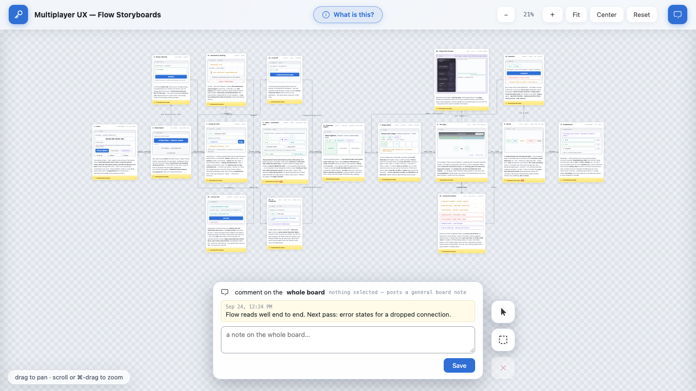
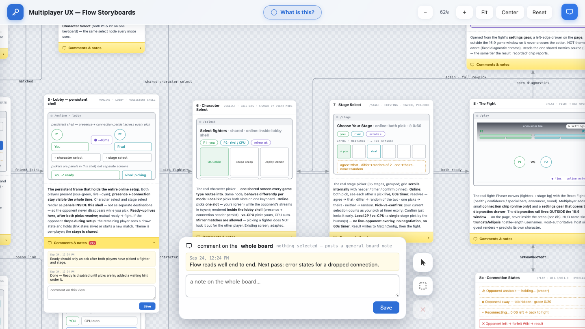
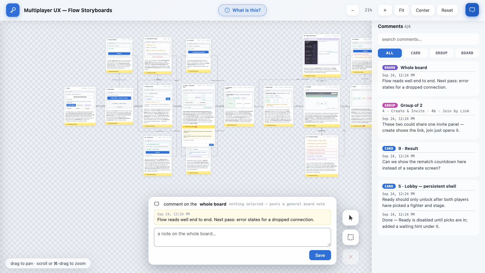
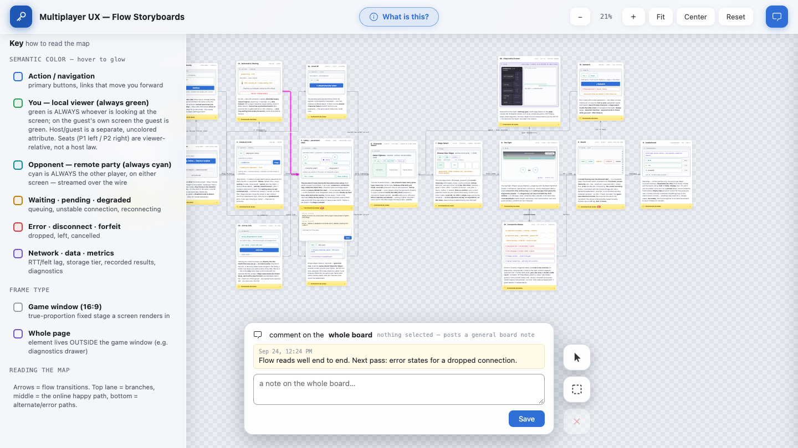
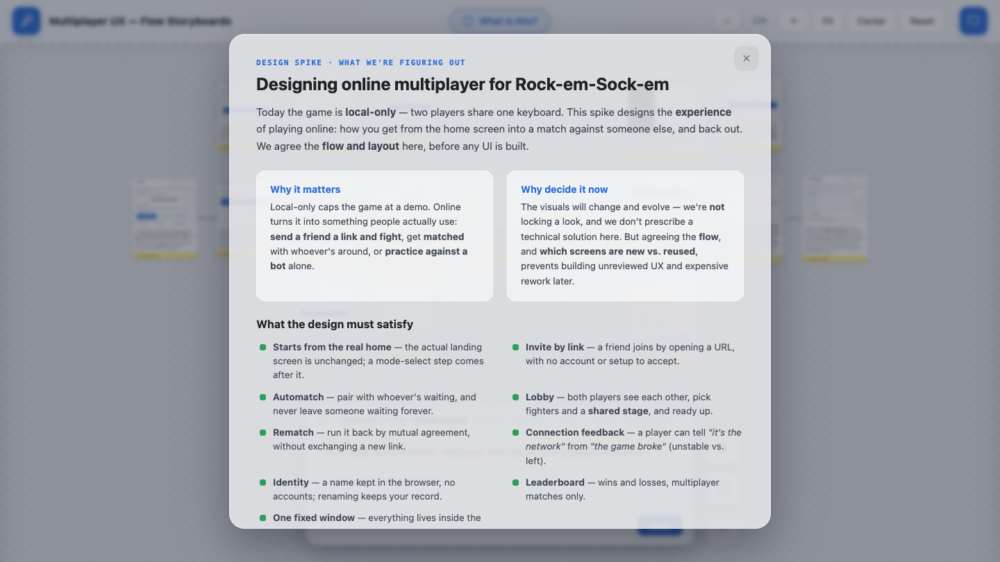

<div align="center">

# FE-UX-Storyboards

**Wireframe storyboards on an infinite canvas, with a feedback loop your AI can use.**

Lay out every screen of a user flow as a low-fidelity wireframe card, connect them with arrows, and
review the flow on a pannable, zoomable board. People leave comments on cards; an AI assistant reads
those comments, edits the board, replies, and archives what it has addressed.

[**▶ Live demo (view-only)**](https://fe-ux-storyboards.netlify.app) ·
[How it works](docs/HOW-IT-WORKS.md) · [Using it with AI](docs/USING-WITH-AI.md) · [API](docs/API.md)

`wireframes` · `ux flows` · `design review` · `MCP` · `zero dependencies`

<a href="https://fe-ux-storyboards.netlify.app"></a><br>
<sub>Scan to open the live demo on your phone</sub>

<br><br>



</div>

> The live demo is the static, **view-only** build: you can pan, zoom, read the Key and the brief,
> but commenting needs the local server. Run it on your machine (below) to get the full feedback loop.

---

## What it is

A small, self-contained tool for agreeing a **user flow** before anyone builds UI:

- **One file describes the board.** Every card (screen), arrow and legend entry lives in
  [`public/frames.js`](public/frames.js). Change that file and reload.
- **A canvas to review it on.** You can drag to pan, scroll to zoom, and fit the whole flow to the
  screen. Hovering an arrow traces the path forward (magenta) and back (cyan).
- **A comment loop, run on your own machine.** You can leave a comment on one card, on a selection of
  cards, or on the whole board. Comments are stored in SQLite, only ever added to, and never
  deleted: "clearing" archives them, and archives can be recovered.
- **AI-ready.** A plain HTTP API and an MCP server let Claude Desktop, Claude Code, Cursor or any
  other MCP client read the feedback, reply to it and archive it. An AI with a browser, such as
  Claude in Chrome, can use the page directly.
- **Zero dependencies.** It needs only Node and nothing from npm. The same `public/` folder deploys
  as a static, view-only site.

The board that ships in this repo is a real example: the multiplayer UX flow designed for
[**rock-em-sock-em**](https://github.com/Folklore-Digital/rock-em-sock-em), a browser fighting
game. (That repo is private to the Folklore team. This one stands on its own.) Its resolved spec and
design reviews are in [`SPEC.md`](SPEC.md) and [`reviews/`](reviews/). Replace the board with your
own. [Make your own board](docs/HOW-IT-WORKS.md#make-your-own-board) explains how.

---

## Screenshots

<table>
<tr>
<td width="50%"><br>
<sub><b>Cards and threads.</b> Each card is a wireframe with a description. Open its <i>Comments &amp; notes</i> bar to read or leave feedback.</sub></td>
<td width="50%"><br>
<sub><b>Every comment in one place.</b> Search and filter notes by card, group of cards or the whole board.</sub></td>
</tr>
<tr>
<td width="50%"><br>
<sub><b>The Key.</b> Colour is only used to carry meaning. Hover an arrow to trace the path (magenta forward, cyan back).</sub></td>
<td width="50%"><br>
<sub><b>The brief.</b> "What is this?" explains the board's goal and what the design has to satisfy.</sub></td>
</tr>
</table>

---

## Run it on your machine

**You need** Node **22.13 or newer**, because comments use Node's built-in `node:sqlite`. Check with
`node --version`.

```bash
git clone https://github.com/jclarkfolklore/FE-UX-Storyboards.git
cd FE-UX-Storyboards
npm start
```

Open **http://localhost:4321**. There is no `npm install` step, because there's nothing to install.

- The first run creates `comments.db` next to `server.mjs`. It's gitignored, so your feedback stays
  local.
- Node may print `ExperimentalWarning: SQLite is an experimental feature`. That's expected.
- Use a different port with `PORT=5000 npm start`.
- The server listens on **localhost only**, because the comment API has no authentication. To let
  other machines on your network reach it, start it with `HOST=0.0.0.0 npm start`, and only on a
  network you trust.

---

## How to use it

| To… | Do this |
|---|---|
| Move around | Drag the background to pan. Scroll, or ⌘/Ctrl-drag, to zoom. Use **Fit**, **Center** and **Reset** in the top bar. |
| Understand the colours | Open the **Key** (top-left). Hover a colour to make every matching element glow. |
| Read the brief | Click **What is this?** in the top bar. |
| Follow the flow | Hover an arrow. The path forward lights magenta and the way back lights cyan. |
| Comment on one card | Open the yellow **Comments & notes** bar at the bottom of the card, type, then **Save**. |
| Comment on several cards | Select cards with the select tools (bottom-right): click to select, or drag a box. They glow yellow. Then write **one** note in the bottom bar. |
| Comment on the whole board | With nothing selected, the bottom bar writes a whole-board note. |
| Find a comment | Click **Comments** in the top bar (right) to search and filter every note by card, group or board. |
| Undo a clear | Click **⤺ recover** under a card's thread to bring its last archived batch back. |

When the page is served without the comment server (for example the static deploy), all the comment
tools hide themselves and the board shows **VIEW ONLY**.

---

## Use it with AI

The loop:

1. People review the board and leave comments.
2. The AI reads them with `get_feedback`, or `GET /api/feedback`.
3. The AI edits `public/frames.js`, then replies on the card with `add_comment`.
4. You reload and review. When the batch is done, the AI archives it with `archive_feedback`.

**Claude Desktop (or any MCP client).** Keep `npm start` running, then add this to
`claude_desktop_config.json` (**Settings → Developer → Edit Config**) and restart Claude Desktop:

```json
{
  "mcpServers": {
    "fe-ux-storyboards": {
      "command": "node",
      "args": ["/absolute/path/to/FE-UX-Storyboards/mcp.mjs"],
      "env": { "STORYBOARDS_URL": "http://localhost:4321" }
    }
  }
}
```

**Claude Code:**
`claude mcp add fe-ux-storyboards -e STORYBOARDS_URL=http://localhost:4321 -- node /absolute/path/to/FE-UX-Storyboards/mcp.mjs`

**Claude in Chrome, or any AI with a browser:** point it at `http://localhost:4321`. It can read the
cards, and it can fetch `/api/frames` and `/api/feedback` directly.

[docs/USING-WITH-AI.md](docs/USING-WITH-AI.md) has step-by-step setup for each client,
troubleshooting and prompts you can copy.

---

## Publish a view-only copy

`public/` is plain static files, so any static host works: Netlify, GitHub Pages, S3 and so on.
There's no build step. With no `/api` behind it, the board is read-only.

```bash
npx netlify-cli deploy --prod --dir=public   # netlify.toml already publishes public/
```

That's exactly how the [live demo](https://fe-ux-storyboards.netlify.app) is published.

---

## What's in the repo

| Path | What it is |
|---|---|
| `public/frames.js` | **The board.** Its title and brief (`BOARD`), cards (`FRAMES`), arrows (`LINKS`) and key (`LEGEND`). |
| `public/app.js` | The canvas: layout, arrow routing, pan and zoom, selection, and the comment UI. |
| `public/index.html`, `public/styles.css` | The page shell and the wireframe visual language. |
| `server.mjs` | Serves the page on your machine, plus the comment API (SQLite). |
| `mcp.mjs` | The MCP server. It wraps the comment API as tools for AI clients. |
| `docs/` | [How it works](docs/HOW-IT-WORKS.md) · [Using it with AI](docs/USING-WITH-AI.md) · [API](docs/API.md) |
| `SPEC.md`, `reviews/` | The worked example's resolved spec and design reviews (rock-em-sock-em multiplayer). |
